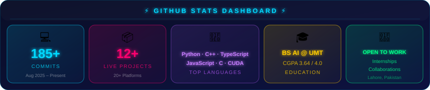
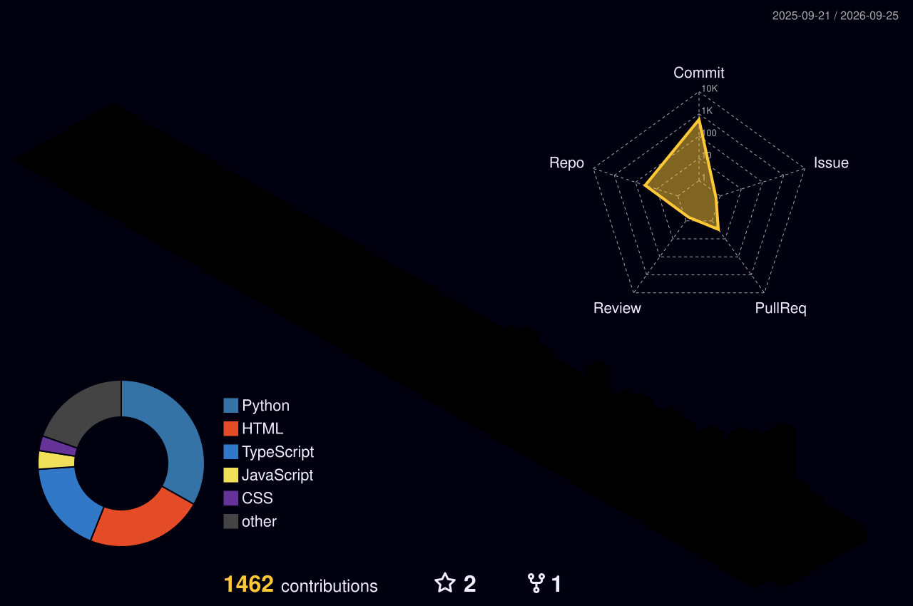
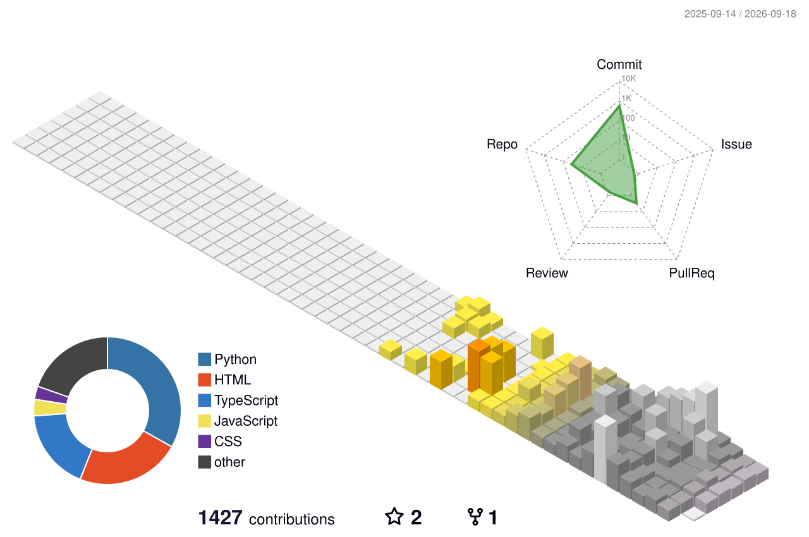

<div align="center">

[](https://git.io/typing-svg)

<br/>

[](https://portfolio-website-jet-iota-21.vercel.app) [](https://huggingface.co/Abdullah-Javid) [](https://linkedin.com/in/abdullah-javid-b217a2384) [](mailto:mabdullah.ab614@gmail.com)

<br/><br/>

[](https://portfolio-website-jet-iota-21.vercel.app)

<br/>


[](https://portfolio-website-jet-iota-21.vercel.app)


</div>


##  About Me

```python
class AbdullahJavid:
    role       = ["AI Developer", "ML Engineer", "Builder & Deployer"]
    education  = "BS Artificial Intelligence @ UMT Lahore (CGPA: 3.64/4.0)"
    location   = "Lahore, Punjab, Pakistan"
    languages  = ["Python", "TypeScript", "JavaScript", "C++"]
    frameworks = ["PyTorch", "YOLOv8", "Next.js", "FastAPI", "Gradio"]
    ai_apis    = ["Claude API", "GPT-4", "Gemini", "Groq", "HuggingFace"]
    deployed   = " 17+ live AI apps across 5+ global platforms"
    passion    = "Turning AI research into production-ready tools"
    status     = "Open to Internships & Collaborations"

    def hello(self):
        return "Let's build something amazing with AI!"
```


##  Currently Building

<div align="center">

[](https://portfolio-website-jet-iota-21.vercel.app)
[](https://linkedin.com/in/abdullah-javid-b217a2384)
[](mailto:mabdullah.ab614@gmail.com)

</div>


##  Featured AI Projects

<div align="center">

| Project | Model | Metric | Stack | Live |
|:--------|:------|:-------|:------|:-----|
| 🧠 **Brain Tumor Detector** | ResNet18 | **92.2%** - 7,200 MRI | PyTorch, Gradio | [](https://huggingface.co/spaces/BUDDDY2894830/brain-tumor-detector) |
| 🔬 **Skin Disease Detector** | ResNet18 | **71.8%** - 9 conditions | PyTorch, Gradio | [](https://huggingface.co/spaces/BUDDDY2894830/skin-disease-detector) |
| 🤖 **Nexus AI Assistant** | Groq - 4 LLMs | 10 languages + web | Gradio, Groq | [](https://huggingface.co/spaces/BUDDDY2894830/nexus-ai-assistant) |
| 🐾 **Animal Detector** | YOLOv8 | 10 species real-time | OpenCV, Gradio | [](https://huggingface.co/spaces/BUDDDY2894830/animal-detector) |
| 💊 **Tablet Defect Inspector** | ResNet18 | Good vs Defective | PyTorch, Gradio | [](https://huggingface.co/spaces/BUDDDY2894830/tablet-defect-inspector) |
| ✍️ **Air Writer** | MediaPipe | 30fps - zero hardware | OpenCV, Gradio | [](https://huggingface.co/spaces/Abdullah2894830/air-writer) |
| ♟️ **ChessMaster** | Minimax + Alpha-Beta | 20+ openings - ELO | TypeScript | [](https://mabdullahab614-alt.github.io/chessmaster/) |
| 🎮 **Galactic Defender** | Pygame to WASM | Boss battle - 3 modes | Pygame | [](https://aabdullah2894830.itch.io/galactic-defender-absolute-zero) |
| ⚡ **SURGE** | C++17 + raylib → WASM | 3 stages · 3 bosses · chain-dash | C++, raylib | [](https://mabdullahab614-alt.github.io/surge/) |
| 🐍 **Snake Strike** | Canvas API | Web Audio - mobile | JavaScript | [](https://mabdullahab614-alt.github.io/snake-strike/) |
| 🌐 **Portfolio Website** | Next.js 15 | Neural net - 3D effects | Next.js, Framer | [](https://portfolio-website-jet-iota-21.vercel.app) |
| ⚡ **Quick Summarizer** | Frequency Scoring | 48.6% compression · zero deps | HTML, JS | [](https://mabdullahab614-alt.github.io/quick-summarizer) |
| 🧠 **Sentiment Snap** | DistilBERT | 99.99% confidence · Positive/Negative | Python, Streamlit | [](https://huggingface.co/spaces/Abdullah2894830/sentiment-snap) |
| 🎮 **Mind Bender** | Minimax + Alpha-Beta | Unbeatable AI · 3 Game Modes | Python, Gradio | [](https://huggingface.co/spaces/Abdullah2894830/mind-bender-game) |
| 👻 **Phantom Writer** | Hybrid Stylometric · AI Detector + Humanizer · Bypass detectors instantly | Python, Flask | 🌐 Render · Green & White UI · ML Model | [](https://phantom-writer.onrender.com) |
| 🛡️ **Mail Sentinel** | TF-IDF + Naive Bayes · 97%+ accuracy · Neural spam detection instantly | Python, Streamlit | 🌐 Render · Neon Cyber UI · NLP Pipeline | [](https://mail-sentinel-hy47.onrender.com) |
| 🖩 **Calculator by Abdullah** | C# → Web | Scientific · Dark UI · Keyboard Support | HTML, JS, C# | [](https://calculator-by-abdullah.onrender.com) |

</div>


##  Certifications & Achievements

<div align="center">

[](https://portfolio-website-jet-iota-21.vercel.app)

</div>


##  GitHub Stats

<div align="center">

[](https://github.com/mabdullahab614-alt?tab=repositories)&nbsp;&nbsp;[](https://github.com/mabdullahab614-alt)&nbsp;&nbsp;[](https://github.com/mabdullahab614-alt)&nbsp;&nbsp;[](https://github.com/mabdullahab614-alt)

<br/>


[](https://github.com/mabdullahab614-alt)


<br/>

[](https://github.com/mabdullahab614-alt)

<br/>

[](https://github.com/mabdullahab614-alt?tab=followers)
[](https://github.com/mabdullahab614-alt?tab=repositories)
[](https://huggingface.co/Abdullah-Javid)
[](https://github.com/mabdullahab614-alt)

<br/>

[](https://github.com/mabdullahab614-alt)

<br/>

[](https://github.com/mabdullahab614-alt)

</div>


##  Contribution Snake


---

## 🌆 3D Contribution City






##  Dev Joke of the Day

<div align="center">

[](https://github.com/mabdullahab614-alt)

</div>


##  Quote of the Day

<div align="center">

[](https://github.com/piyushsuthar/github-readme-quotes)

</div>


##  Connect

<div align="center">

[](mailto:mabdullah.ab614@gmail.com)
[](https://linkedin.com/in/abdullah-javid-b217a2384)
[](https://huggingface.co/Abdullah-Javid)
[](https://github.com/mabdullahab614-alt)
[](https://portfolio-website-jet-iota-21.vercel.app)

<br/>


<br/>

[](https://git.io/typing-svg)

</div>

---


